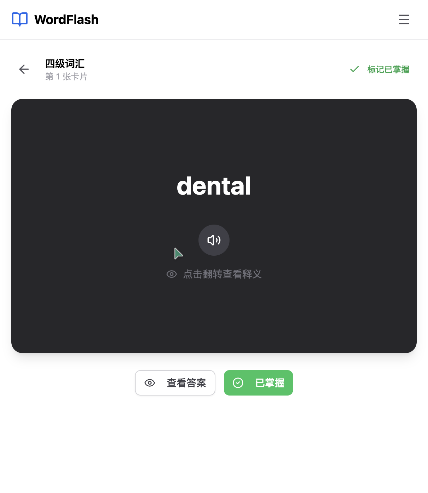
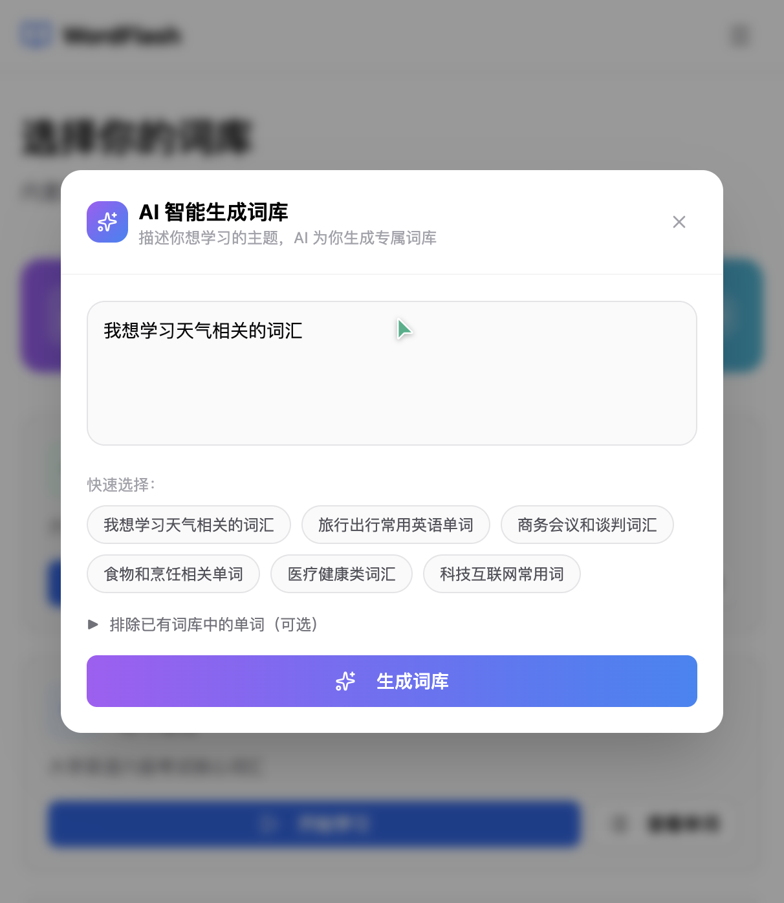
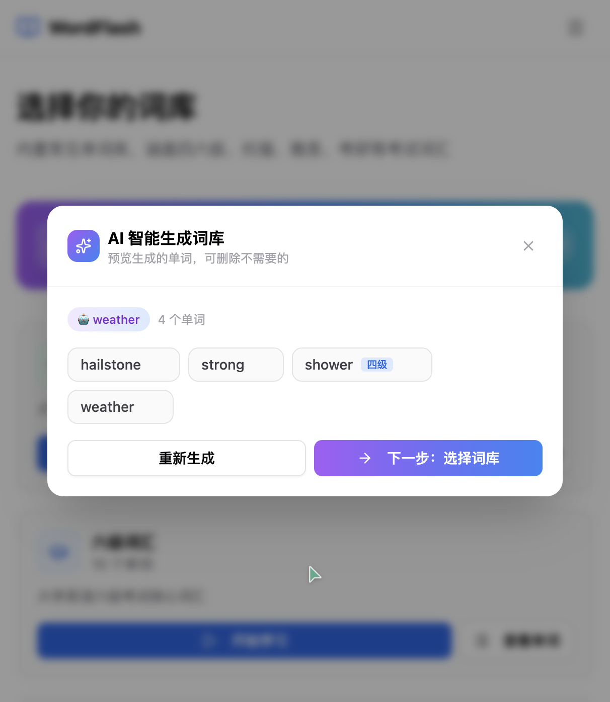

# WordFlash 用户手册

## 1. 首页概览

打开应用后，首页展示所有可用的词库卡片。每个卡片显示词库名称、单词数量和描述，提供「开始学习」和「查看单词」两个入口。

**内置词库包括：**
- 四级词汇（4543 词）、六级词汇、托福词汇、雅思词汇
- 英语八级、BEC 商务、高中词汇、高频 10000

**AI 生成的词库**会以 🤖 图标标识，**已掌握词库**以 ✅ 图标标识。

---

## 2. 开始学习

点击任意词库卡片的「开始学习」按钮，进入闪卡学习模式。

**学习操作：**
- 点击「查看答案」翻转卡片，查看单词释义
- 根据掌握程度点击「不认识」或「已掌握」
- 系统会根据你的反馈调整单词的出现频率

---

## 3. AI 智能生成词库

点击首页顶部的紫色渐变横幅「AI 智能生成词库」，打开生成对话框。

### 3.1 输入学习主题

在文本框中描述你想学习的主题，例如：
- "我想学习天气相关的词汇"
- "商务会议和谈判词汇"
- "医疗健康类词汇"

也可以点击下方的快速选择标签自动填入。

### 3.2 排除已有单词（可选）

点击「▶ 排除已有词库中的单词（可选）」展开排除设置：

- AI 会自动判断哪些词库与你的主题相关，并推荐在最前面
- 选择一个词库后，生成时会**自动过滤掉该词库中已有的单词**，只生成新单词
- 也可以选择「不排除」来生成全新单词

### 3.3 预览和删减单词

AI 生成完成后，进入预览页面：

- 每个单词旁的蓝色标签表示该单词属于哪些内置词库（如【四级】【高中】）
- **鼠标悬停**到单词上，右侧出现红色 ✕ 按钮，点击可删除不需要的单词
- 删除的单词会自动标记为「已掌握」，下次 AI 生成时自动跳过

### 3.4 选择目标词库

点击「下一步：选择词库」：

- **创建新词库**（默认）：创建一个新的 AI 主题词库
- **相关词库**：AI 推荐的与主题相关的已有词库，选择后会将新单词合并进去
- **查看所有词库**：展开可看到全部词库供选择

### 3.5 创建并学习

选择好目标词库后，点击「创建并开始学习」或「合并并开始学习」，系统会自动创建词库并跳转到学习页面。

---

## 4. 词库管理

### 4.1 删除词库

鼠标悬停到**非内置词库**（AI 生成的词库）卡片上，右上角出现 🗑️ 删除按钮。

点击后弹出确认对话框：
- 显示词库名称和单词数量
- 可选择将单词**合并到其他词库**（选择目标词库后按钮变为「合并并删除」）
- 或直接删除（不保留单词）

### 4.2 已掌握词库

系统会自动维护一个「✅ 已掌握」词库：
- 在 AI 生成预览中删除的单词会自动归入此词库
- 不在任何词库中的已掌握单词也会归入此词库
- AI 生成新单词时会自动过滤掉所有已掌握的单词

---

## 5. 快捷操作

| 操作 | 说明 |
|------|------|
| 点击词库卡片「开始学习」 | 进入该词库的闪卡学习模式 |
| 点击词库卡片「查看单词」 | 查看该词库的所有单词列表 |
| 点击首页紫色横幅 | 打开 AI 智能生成词库对话框 |
| 在预览页面悬停单词 | 显示删除按钮，标记为已掌握 |
| 悬停 AI 词库卡片 | 显示删除按钮，可删除或合并词库 |
